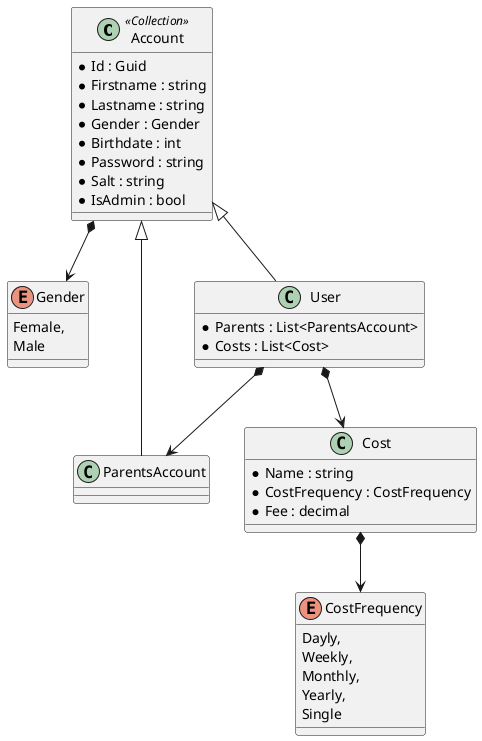

# NoSQL Modell für alvin Webapp

```plantuml
@startuml

class Account<<Collection>> {
    *Id : Guid
    *Firstname : string
    *Lastname : string
    *Gender : Gender
    *Birthdate : int
    *Password : string
    *Salt : string
    *IsAdmin : bool
}
Account *--> Gender

class User {
    *Parents : List<ParentsAccount>
    *Costs : List<Cost>
}
User *--> ParentsAccount

class ParentsAccount {

}

ParentsAccount -up-|> Account
User -up-|> Account


class Cost {
    *Name : string
    *CostFrequency : CostFrequency
    *Fee : decimal
}
Cost *--> CostFrequency

enum CostFrequency {
    Dayly,
    Weekly,
    Monthly,
    Yearly,
    Single
}

enum Gender {
    Female,
    Male
}

User *--> Cost


@enduml


```